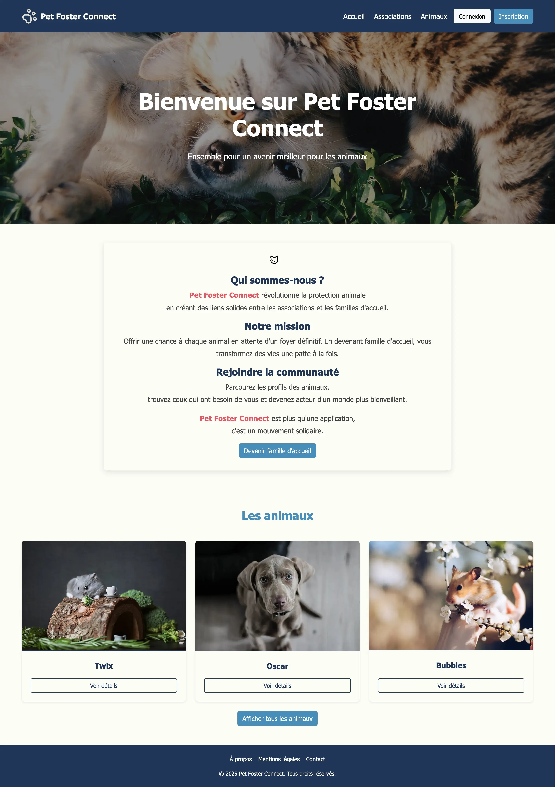

# Pet Foster Connect

 Ce projet a été réalisé dans le cadre d’un projet académique.



## Présentation

**Pet Foster Connect** est une plateforme web qui facilite la mise en relation entre :

- des familles d’accueil temporaires souhaitant héberger un animal dans l’attente de son adoption,
- des associations de protection animale proposant des animaux à placer.

Notre objectif : **offrir une vie meilleure aux animaux**, en leur évitant un passage par des refuges surchargés, grâce à des hébergements temporaires dans des foyers aimants.

---

## Stack technique

- **Frontend** : React, Bootstrap
- **Backend** : Node.js, Express
- **Base de données** : PostgreSQL, Sequelize ORM 

🎨 Le design est simple et épuré, conçu pour être accessible à toutes et tous, y compris les personnes peu familières avec Internet.

## Installation

1. **Cloner le dépôt** :

```
HTTPS : git clone https://github.com/AmelMhdi/pet-foster.git

SSH : git@github.com:AmelMhdi/pet-foster.git
```

2. **Naviguer dans le dossier** :

```bash
cd pet-foster
```

3. **Installer les dépendances (racine + front)** :

```bash
cd backend             # Pour le backend
npm install
cd ..

cd frontend            # Pour le frontend
npm install
cd ..           
```

4. **Créer les fichiers d'environnement** :

```bash
cd backend                     # Backend
cp .env.example .env
cd ..

cd frontend                    # Frontend
cp .env.example .env
```

5. **Créer la base de données**

```sql
-- À exécuter dans psql ou votre client SQL
CREATE ROLE votreRole WITH LOGIN PASSWORD 'password';
CREATE DATABASE votreBDD WITH OWNER votreRole;
```

6. **Initialiser la base de données** :

```bash
cd backend
npm run db:reset
```

7. **Lancer le projet**

```bash
# Terminal 1 (frontend)
cd frontend
npm run dev
```

```bash
# Terminal 2 (backend)
cd backend
npm run dev
```